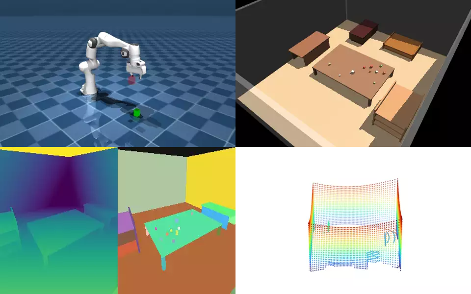
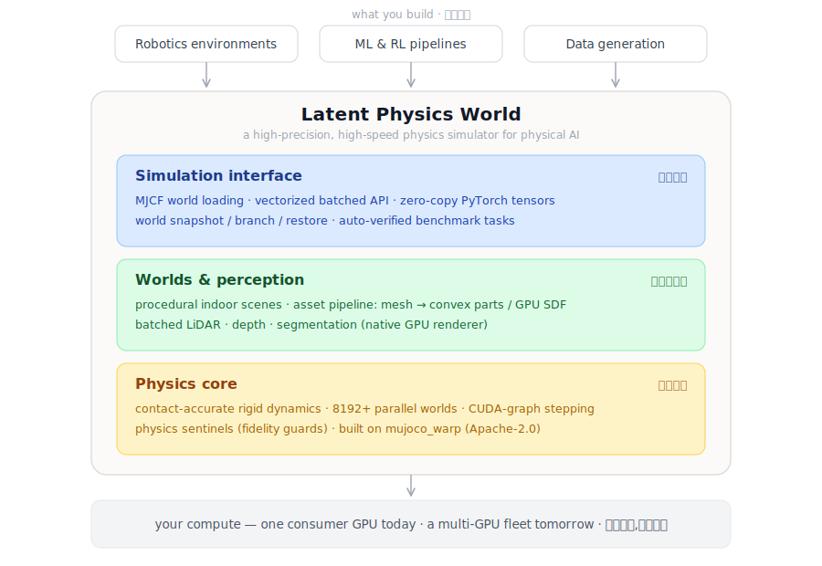
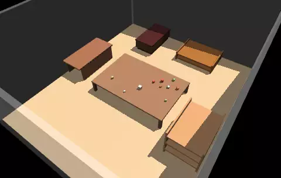
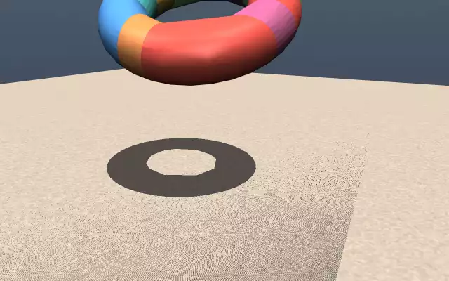
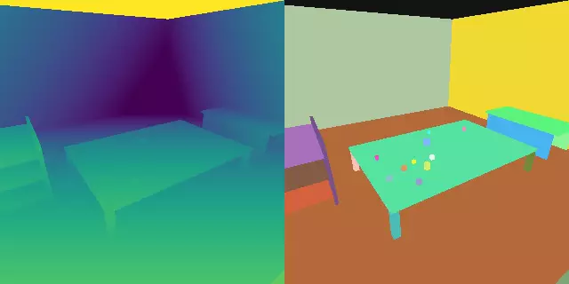
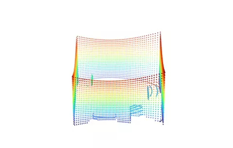

<div align="center">



# Latent Physics World

### The world engine for physical intelligence.
### 物理智能的世界引擎 · 物理大模型的基座。

Robots learn to touch, grasp, and move through the human world —
thousands of parallel lifetimes at a time — before they ever step into ours.
The substrate for **physical foundation models**.

*让机器人在踏入现实之前,先在成千上万个并行的物理世界里,学会触碰、抓取与穿行。*
*—— 训练**物理大模型**的基座。*

</div>

---

## The bottleneck to physical intelligence isn't the brain — it's the world.

Foundation models can already reason, plan, and speak. What they cannot do is
*act* — because acting in the physical world takes billions of contact-rich
interactions to learn, and the real world does not scale. It cannot be reset,
it cannot be parallelized, and every failure has a cost. A robot cannot learn
to load a dishwasher by breaking ten thousand of them.

Simulation is the only path to physical intelligence at scale — **but only if
it is contact-accurate, massively parallel, and transferable to reality.** And
the environment that matters most is also the hardest: the cluttered, contact-
dense **human indoor world**, where robots must both manipulate and navigate.

> **物理智能的瓶颈不是大脑,是世界。** 大模型已经会推理、规划、对话,唯独不会*行动*——
> 因为在物理世界中行动,需要以亿计的接触交互去学习,而真实世界无法扩展、不能重置、
> 每次失败都有代价。通往规模化物理智能的唯一路径是仿真——**前提是它接触精确、能大规模
> 并行、且能迁移回真机。** 而最有价值也最难的环境,正是杂乱、接触密集的**人类室内世界**:
> 机器人要在其中同时完成操作与导航。

## What we are building

**Latent Physics World (LPW)** is a GPU-native world engine where thousands of
physical worlds run in parallel, contact-accurate, on a single accelerator.
Robots are born here, fail here, and grow here — and the skills they learn
transfer to real hardware. It is the substrate on which **physical foundation
models** are trained — physics learned and rolled out in latent space, at scale.

Not a viewer of the world. An engine that *runs* it.

> **Latent Physics World(LPW)** 是一个 GPU 原生的世界引擎:单张加速卡上,成千上万个
> 物理世界并行运行、接触精确。机器人在这里出生、试错、成长,学到的技能可迁移到真实硬件。
> 它是训练**物理大模型**的基座——把物理放进**潜空间**去学习与推演,并可大规模并行;
> 不是世界的观察者,而是*运行*世界的引擎。

<div align="center">

</div>

LPW sits between what you build and what you compute on. Above the box:
your models, policies, and data engines. Below it: one consumer GPU today, a
fleet tomorrow. Beside it — the part that matters most — the closed loop:
models improve in the world, and the world refines itself from reality.

> LPW 位于"你的应用"与"你的算力"之间:上面是你的模型、策略与数据引擎,下面是从单卡到
> 舰队的算力;旁边是最关键的部分——**双向闭环**:模型在世界中变强,世界从现实中变准。

## What makes it different

| | Pillar | 支柱 |
|---|---|---|
| **⚡** | **Contact-accurate physics at scale** — thousands of parallel worlds on one GPU, with production-grade contact and friction. | 数千并行世界的接触精确物理 |
| **🏠** | **Indoor worlds on demand** — a pipeline that turns raw 3D assets into simulatable, collision-ready worlds. | 按需生成的室内世界(资产管线) |
| **👁** | **Multi-modal perception** — LiDAR, depth, and segmentation, GPU-batched across every world. | 多模感知(LiDAR·深度·分割) |
| **🎯** | **Sim-to-real** — domain randomization and calibration built to close the reality gap. | sim-to-real(域随机化 + 标定) |
| **🧠** | **Learning-native** — zero-copy PyTorch tensors, fully batched; the simulator speaks the language of the models it trains. | 面向学习(torch·批量·零拷贝) |

## Gallery — real runs, real numbers

LPW is early and moving fast — and it already runs. Every clip below is an
actual simulation from this repo on a single consumer GPU (RTX 5070 Ti),
backed by committed tests. Nothing staged, nothing rendered offline.

> LPW 尚处早期、推进很快——但**已经能跑**。以下每段动图都是本仓库在单张消费级
> GPU 上的真实运行,数字均有已提交的测试背书,无摆拍。

| | | |
|---|---|---|
| **Trained policy — 100% success** PPO on 2048 parallel worlds; deterministic eval 100%. *PPO 策略,确定性评估 100% 成功* ([train](examples/train_franka_reach.py)) | **Procedural indoor worlds** seeded rooms: walls, furniture, clutter, cameras. *程序化室内场景(可复现)* ([code](latentphysics/assets/scene_gen.py)) | **Asset pipeline** concave mesh → CoACD convex parts → simulation. *凹网格→凸分解→仿真* ([code](latentphysics/assets/__init__.py)) |
|  |  |  |
| **GPU depth + segmentation** native batch renderer, meters-true depth. *批量深度+分割(米制)* ([code](latentphysics/perception/camera.py)) | **Batched LiDAR** 5,760 beams × N worlds in one launch → point clouds. *批量激光雷达点云* ([code](latentphysics/perception/lidar.py)) | **~5M physics steps/s** 8192 contact-accurate worlds on one GPU; contact forces match the reference engine to 0.00%. *单卡 8192 世界,约每秒五百万物理步* ([test](tests/test_envs_gpu.py)) |
|  |  |  |

And the whole thing speaks PyTorch:

```python
import latentphysics as lpw

scene = lpw.load_scene("scenes/kitchen.xml", lpw.Config(n_worlds=4096))
for _ in range(1000):
    scene.step()          # thousands of worlds, one GPU, contact-accurate
obs = scene.qpos()        # zero-copy PyTorch tensor, ready to train on
```

*Getting started and platform requirements (Linux / NVIDIA CUDA) live in [`docs/`](docs/).*

## Roadmap — from one precise arm to self-improving physical AI

The destination is a closed loop: models improve in the world, and the world
improves from reality. Each stage is a shippable capability on that path.

> **路线图——从一只精确的机械臂,到自我改进的物理智能。** 终点是一个闭环:
> 模型在世界中变强,世界从现实中变准。每一阶段都是通往终点的可交付能力。

| Stage | | Milestone · 里程碑 |
|---|---|---|
| **R0 · Engine core** | ✅ | Contact-accurate GPU physics + asset pipeline, verified on real hardware. 接触精确的 GPU 物理与资产管线,真实硬件验证。 |
| **R1 · Precision manipulation** | ▶ | Robot-arm manipulation trained end-to-end: vectorized envs, reference-engine fidelity gate, physics sentinels, RL baselines. 机械臂操作端到端训练:向量化环境、保真基准、物理哨兵、RL 基线。 |
| **R2 · Worlds & perception at scale** | | Procedural indoor scenes; depth, segmentation, LiDAR; an auto-verified manipulation benchmark suite at millions of steps/s. 程序化室内场景与多模感知,数百万步/秒的自动验证任务基准。 |
| **R3 · The self-improving simulator** | | Real-robot calibration and learned residual dynamics — physics refined in latent space from deployment data. The loop starts running both ways. 真机标定 + 残差学习动力学:用真实数据在潜空间中修准物理,双向闭环启动。 |
| **R4 · RSI infrastructure** | | Automatic task generation with verifiable rewards, curriculum engines, world-state branching and deterministic replay, anti-exploit guards, trajectory data engine. 自动任务生成与可验证奖励、课程引擎、世界状态分支与确定性重放、反作弊防线、数据引擎。 |
| **R5 · The closed loop** | | Generation-over-generation improvement of physical foundation models at fleet scale — the substrate where physical intelligence compounds. 物理大模型的代际复利改进——物理智能在这里滚雪球。 |

## Acknowledgements — we stand on open foundations

LPW's physics core is built on the shoulders of open research and open source.
We gratefully build on and depend upon [MuJoCo](https://github.com/google-deepmind/mujoco)
and [mujoco_warp](https://github.com/google-deepmind/mujoco_warp) (Apache-2.0),
[NVIDIA Warp](https://github.com/NVIDIA/warp), and [PyTorch](https://pytorch.org).
Full attribution is in [`NOTICE`](NOTICE) and [`THIRD_PARTY_NOTICES.md`](THIRD_PARTY_NOTICES.md).

> LPW 的物理内核站在开放研究与开源社区的肩膀上,谨致谢并依赖上述项目;完整署名见 `NOTICE`。

---

<div align="center">

**Building the world where physical intelligence is born.**

</div>
