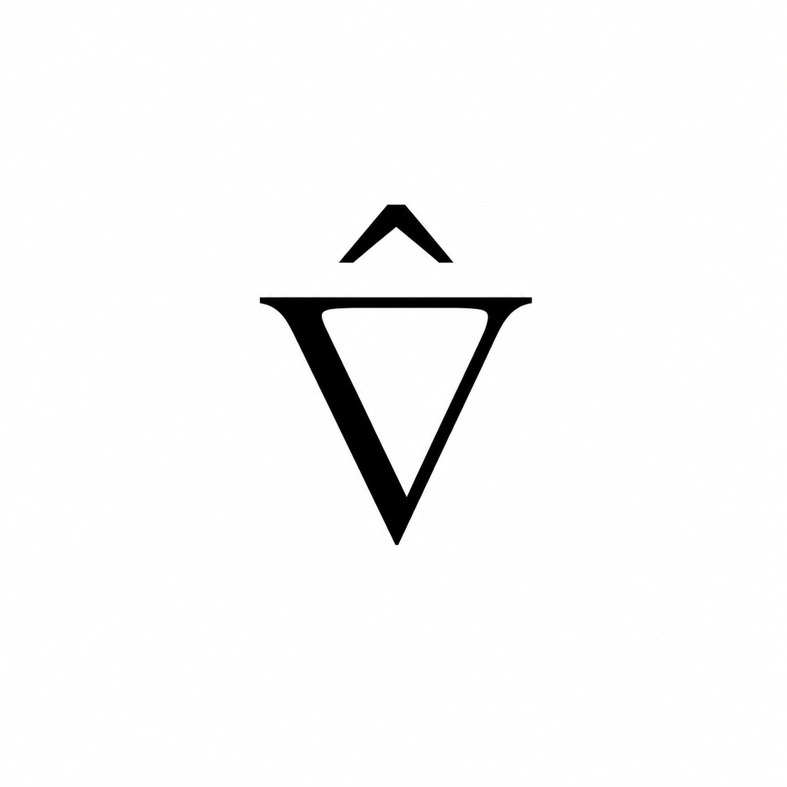
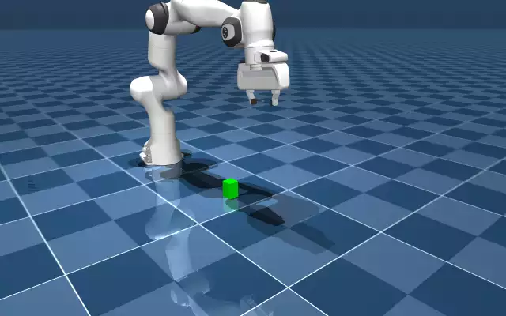
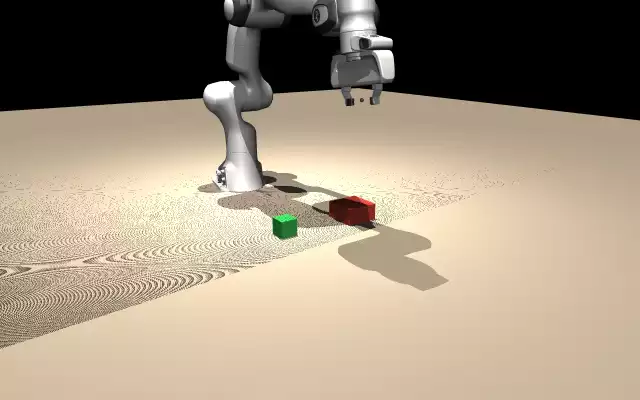
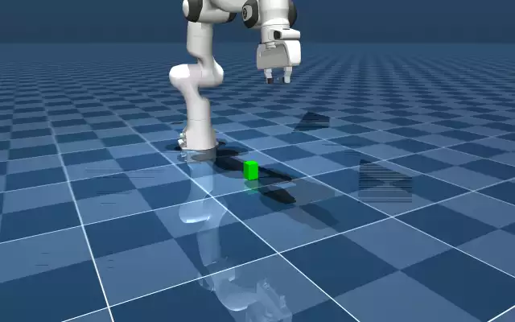
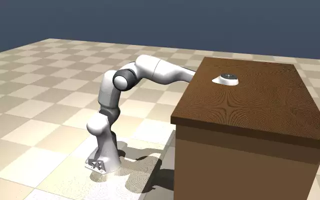

<div align="center">



# Latent Physics World

### A high-precision, high-speed physics simulator for physical AI.

Thousands of contact-accurate worlds on a single GPU — where robots learn
to touch, grasp, and move through the human world before they ever step into ours.

</div>

---

## The bottleneck to physical intelligence isn't the brain — it's the world.

Foundation models can already reason, plan, and speak. What they cannot do is
*act* — because acting in the physical world takes billions of contact-rich
interactions to learn, and the real world does not scale. It cannot be reset,
it cannot be parallelized, and every failure has a cost. A robot cannot learn
to load a dishwasher by breaking ten thousand of them.

Simulation is the only path to physical intelligence at scale — **but only if
it is contact-accurate, massively parallel, and transferable to reality.** And
the environment that matters most is also the hardest: the cluttered, contact-
dense **human indoor world**, where robots must both manipulate and navigate.

## What we are building

**Latent Physics World (LPW)** is a GPU-native physics simulator built around
two numbers: **how closely contact matches reality, and how many worlds run
per second.** Thousands of contact-accurate worlds in parallel on a single
accelerator — built so what happens inside transfers to real hardware.

Not a viewer of the world. An engine that *runs* it.

<div align="center">

</div>

LPW sits between what you build and what you compute on: above the box, your
environments, pipelines, and data engines; below it, whatever compute you
have — one consumer GPU today, a fleet tomorrow.

## What makes it different

| | Pillar |
|---|---|
| **⚡** | **Contact-accurate physics at scale** — thousands of parallel worlds on one GPU, with contact forces gated against the C-engine reference. |
| **🏠** | **Indoor worlds on demand** — a pipeline that turns raw 3D assets into simulatable, collision-ready worlds. |
| **👁** | **Multi-modal perception** — LiDAR, depth, and segmentation, GPU-batched across every world. |
| **⏪** | **State you can rewind** — snapshot, branch, and restore the full physics state of every world in one call; rollouts you can rerun, fork, and interrogate. |
| **🧠** | **PyTorch-native interface** — zero-copy tensors, fully batched; simulation state flows straight into your stack. |

## Gallery — real runs, real numbers

LPW is early and moving fast — and it already runs. Every clip below is an
actual simulation from this repo on a single consumer GPU (RTX 5070 Ti), and
every label links to the script that produced it — each one carrying a hard
physical assert. Nothing staged: physics always runs live on the GPU engine;
the clips are replays of the recorded trajectories. Settled contact forces
match the C-engine reference to **0.00% measured** (committed gate: <5%).
The Franka manipulation scene steps at **8.6M physics steps/s measured across
8192 worlds** (committed regression floor: 4M). The Franka runs a **spread of
scripted tasks — pick-and-place, stacking, pushing, sorting, sweeping, peg
insertion, drawer opening** — via IK-scripted contact (no learned policies),
and a **12-task benchmark suite** auto-verifies behavior with physically
checkable predicates. Every number above sits next to the committed test that
enforces it.

| | | |
|---|---|---|
| [Manipulation: pick & place](examples/franka_pick_place.py) | [Manipulation: stack](examples/franka_stack.py) | [Manipulation: push](examples/franka_push.py) |
|  |  |  |
| [Manipulation: peg-in-hole](examples/franka_peg_insert.py) | [Manipulation: sort into bin](examples/franka_sort.py) | [Manipulation: sweep clutter](examples/franka_sweep.py) |
|  |  |  |
| [Manipulation: open drawer](examples/franka_open_drawer_arm.py) | [Rigid: collision tower](examples/collision_tower.py) | [Rigid: contype masks](examples/contype_demo.py) |
|  |  |  |
| [Worlds: procedural room](examples/procedural_room.py) | [Worlds: articulated furniture](examples/articulated_room.py) | [Assets: real CC0 meshes](examples/real_assets.py) |
|  |  |  |
| [Assets: GLB scene import](examples/glb_import.py) | [Assets: convex decomposition](examples/convex_decomposition.py) | [Perception: depth + segmentation](examples/perception_camera.py) |
|  |  |  |
| [Perception: lidar point cloud](examples/perception_lidar.py) | [Physics: 8192 parallel worlds — 16 shown](examples/parallel_worlds.py) | |
|  |  | |

And the whole thing speaks PyTorch:

```python
import latentphysics as lpw

scene = lpw.load_scene("examples/scenes/falling_box.xml", lpw.Config(n_worlds=4096))
scene.step(500)           # 4096 worlds advance together on one GPU
obs = scene.qpos()        # zero-copy PyTorch tensor (4096, nq), already on-device

snap = scene.snapshot()   # full physics state of every world, one call
scene.step(200)           # ...explore a branch
scene.restore(snap)       # ...rewind all 4096 worlds and try again
```

This exact snippet is executed by a committed test
([`tests/test_readme_snippet_gpu.py`](tests/test_readme_snippet_gpu.py)) —
if it breaks, CI breaks.

*Getting started — platform (Linux / WSL2 + NVIDIA CUDA), install, first run —
lives in [`docs/GETTING_STARTED.md`](docs/GETTING_STARTED.md).*

## Under the hood — enforced by committed tests

- **Snapshot / restore / branch.** The full physics state of all worlds is
  captured in one call; a boolean mask restores any subset — branch a few
  worlds back in time while the rest run on. Replay after restore reproduces
  trajectories to ~1e-7 (GPU float-atomic noise; bit-exact replay is engine
  fork work on the roadmap). [`tests/test_backend_gpu.py`](tests/test_backend_gpu.py)
- **CUDA-graph stepping.** `scene.step(n)` replays a captured single-step
  graph n times — Python-driven kernel launches, not physics, dominate
  wall-clock otherwise (measured ~40x). The committed throughput floors run
  this path. [`tests/test_throughput_gpu.py`](tests/test_throughput_gpu.py)
- **Budgets that fail loud.** Contact and constraint buffers auto-scale to
  the scene; an undersized budget raises `BudgetOverflow` at step time
  instead of silently corrupting the solve to NaN.
  [`tests/test_backend_gpu.py`](tests/test_backend_gpu.py)
- **Physics sentinels.** Per-world watchdogs for deep penetration, velocity
  explosions, and non-finite state — the first anti-exploit guardrail for
  learning at scale. [`tests/test_sentinels_gpu.py`](tests/test_sentinels_gpu.py)

## Roadmap — accuracy first, then speed, then reality

A simulator earns trust on two axes: how close it is to reality, and how fast
it runs. Every stage below pushes one of the two.

| Stage | | Milestone |
|---|---|---|
| **R0 · Engine core** | ✅ | Contact-accurate GPU physics + asset pipeline, verified on real hardware. |
| **R1 · Precision manipulation** | ✅ | Vectorized simulation interface, reference-engine fidelity gate (contact-force gap vs the C engine: 0.00% measured, <5% enforced), physics sentinels; usability proven end-to-end. |
| **R2 · Worlds & perception** | ✅ | Procedural indoor scenes; GLB/USD scene import; articulated furniture (drawer, door, lid, sliding door) with a verified task family; batched LiDAR, depth, segmentation; a 12-task auto-verified benchmark suite. |
| **R3 · Speed at scale** | | Dynamic-body broadphase + constraint budgeting (the measured cliff), sleep-aware CUDA graphs, multi-GPU. KPI: a 20-free-body cluttered room at ≥1M steps/s across 4096 worlds (today: 0.52M measured, 0.2M floor). |
| **R4 · Determinism & richer sensing** | | Bit-exact deterministic replay (canonical contact ordering is in our engine fork; atomic-free reductions remain), higher-fidelity sensing; soft bodies through the whitelisted FEA / learned-simulation path. KPI: zero replay divergence over 500 steps (today: gated at ~1e-7); any learned solver gated on accuracy vs a classical reference. |
| **R5 · Calibrated to reality** | | Per-world domain randomization (friction, mass, CoM, latency) and real-robot calibration (sysid), with bounded learned residual dynamics. KPI: calibrated sim at least halves sim-vs-real trajectory error on a captured robot log. |

## Acknowledgements — we stand on open foundations

LPW's physics core is built on the shoulders of open research and open source.
We gratefully build on and depend upon [MuJoCo](https://github.com/google-deepmind/mujoco)
and [mujoco_warp](https://github.com/google-deepmind/mujoco_warp) (Apache-2.0),
[NVIDIA Warp](https://github.com/NVIDIA/warp), and [PyTorch](https://pytorch.org).
Full attribution is in [`NOTICE`](NOTICE) and [`THIRD_PARTY_NOTICES.md`](THIRD_PARTY_NOTICES.md).
LPW itself is proprietary — see [`LICENSE`](LICENSE); its license covers our
original work and never restricts the rights those open licenses grant you.

---

<div align="center">

**Building the world where physical intelligence is born.**

<sub>© 2026 Latent Physics World. Proprietary — all rights reserved. See [`LICENSE`](LICENSE).</sub>

</div>
