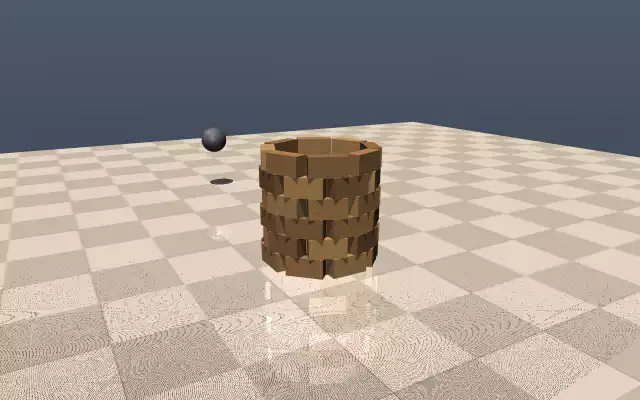
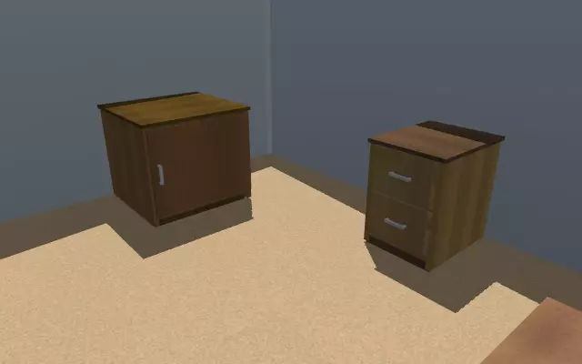
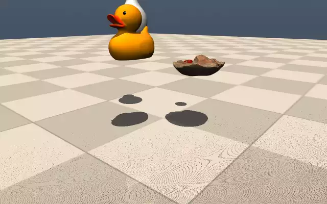

<div align="center">


# Latent Physics World

### A high-precision, high-speed physics simulator for physical AI.

Thousands of contact-accurate worlds on a single GPU — where robots learn
to touch, grasp, and move through the human world before they ever step into ours.

</div>

---

## The bottleneck to physical intelligence isn't the brain — it's the world.

Foundation models can already reason, plan, and speak. What they cannot do is
*act* — because acting in the physical world takes billions of contact-rich
interactions to learn, and the real world does not scale. It cannot be reset,
it cannot be parallelized, and every failure has a cost. A robot cannot learn
to load a dishwasher by breaking ten thousand of them.

Simulation is the only path to physical intelligence at scale — **but only if
it is contact-accurate, massively parallel, and transferable to reality.** And
the environment that matters most is also the hardest: the cluttered, contact-
dense **human indoor world**, where robots must both manipulate and navigate.

## What we are building

**Latent Physics World (LPW)** is a GPU-native physics simulator built around
two numbers: **how closely contact matches reality, and how many worlds run
per second.** Thousands of contact-accurate worlds in parallel on a single
accelerator; what happens inside transfers to real hardware.

Not a viewer of the world. An engine that *runs* it.

<div align="center">

</div>

LPW sits between what you build and what you compute on: above the box, your
environments, pipelines, and data engines; below it, whatever compute you
have — one consumer GPU today, a fleet tomorrow.

## What makes it different

| | Pillar |
|---|---|
| **⚡** | **Contact-accurate physics at scale** — thousands of parallel worlds on one GPU, with production-grade contact and friction. |
| **🏠** | **Indoor worlds on demand** — a pipeline that turns raw 3D assets into simulatable, collision-ready worlds. |
| **👁** | **Multi-modal perception** — LiDAR, depth, and segmentation, GPU-batched across every world. |
| **🎯** | **Sim-to-real** — domain randomization and calibration built to close the reality gap. |
| **🧠** | **PyTorch-native interface** — zero-copy tensors, fully batched; simulation state flows straight into your stack. |

## Gallery — real runs, real numbers

LPW is early and moving fast — and it already runs. Every clip below is an
actual simulation from this repo on a single consumer GPU (RTX 5070 Ti), and
every label links to the code that produced it. Nothing staged, nothing
rendered offline: contact forces match the reference engine to **0.00%**,
the manipulation scene steps at **8M+ physics steps/s** across 8192 worlds,
and a **12-task benchmark suite** auto-verifies behavior with physically
checkable predicates — all enforced by committed tests.

| | | |
|---|---|---|
| [Rigid: franka cube grasp](examples/franka_cube_grasp.py) | [Rigid: collision tower](examples/collision_tower.py) | [Rigid: contype masks](examples/contype_demo.py) |
|  |  |  |
| [Worlds: procedural room](examples/procedural_room.py) | [Worlds: articulated furniture](examples/articulated_room.py) | [Assets: GLB scene import](examples/glb_import.py) |
|  |  |  |
| [Assets: real CC0 meshes](examples/real_assets.py) | [Assets: convex decomposition](latentphysics/assets/__init__.py) | [Assets: GLB scene import](examples/glb_import.py) |
|  |  |  |
| [Perception: depth + segmentation](latentphysics/perception/camera.py) | [Perception: lidar point cloud](latentphysics/perception/lidar.py) | [Physics: 8192 parallel worlds](tests/test_throughput_gpu.py) |
|  |  |  |

And the whole thing speaks PyTorch:

```python
import latentphysics as lpw

scene = lpw.load_scene("scenes/kitchen.xml", lpw.Config(n_worlds=4096))
for _ in range(1000):
    scene.step()          # thousands of worlds, one GPU, contact-accurate
obs = scene.qpos()        # zero-copy PyTorch tensor, ready to train on
```

*Getting started and platform requirements (Linux / NVIDIA CUDA) live in [`docs/`](docs/).*

## Roadmap — accuracy first, then speed, then reality

A simulator earns trust on two axes: how close it is to reality, and how fast
it runs. Every stage below pushes one of the two.

| Stage | | Milestone |
|---|---|---|
| **R0 · Engine core** | ✅ | Contact-accurate GPU physics + asset pipeline, verified on real hardware. |
| **R1 · Precision manipulation** | ✅ | Vectorized simulation interface, reference-engine fidelity gate (0.00% contact-force gap), physics sentinels; usability proven end-to-end. |
| **R2 · Worlds & perception** | ✅ | Procedural indoor scenes; batched LiDAR, depth, segmentation; a 12-task auto-verified benchmark suite. |
| **R3 · Speed at scale** | | BVH broadphase, sleep-aware CUDA graphs, multi-GPU — cluttered 100+ geom scenes at millions of steps per second. |
| **R4 · Richer worlds** | | Indoor scenes from 3D datasets (USD/GLB), articulated furniture, higher-fidelity sensing; soft bodies on the horizon. |
| **R5 · Calibrated to reality** | | Real-robot calibration and learned residual dynamics (latent-space physics) — a simulator that converges to reality over time. |

## Acknowledgements — we stand on open foundations

LPW's physics core is built on the shoulders of open research and open source.
We gratefully build on and depend upon [MuJoCo](https://github.com/google-deepmind/mujoco)
and [mujoco_warp](https://github.com/google-deepmind/mujoco_warp) (Apache-2.0),
[NVIDIA Warp](https://github.com/NVIDIA/warp), and [PyTorch](https://pytorch.org).
Full attribution is in [`NOTICE`](NOTICE) and [`THIRD_PARTY_NOTICES.md`](THIRD_PARTY_NOTICES.md).

---

<div align="center">

**Building the world where physical intelligence is born.**

</div>
